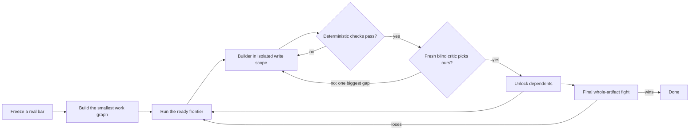

# Bossfight

Take the work to a verified win against a real reference. Do the work in this session. Do not merely generate a prompt for another agent.

Bossfight combines Gauntlet Loop's concrete bar and blind binary critic with pstack's smallest-change, domain-modeling, isolated-state, verifiable-unit, and structural-learning principles.

## The loop

## Non-negotiables

- The bar is named, fetchable, and directly comparable. Capture the real artifact before work starts and freeze its digest. Compare like with like: implementation with implementation, rendered page with rendered page, article with article. A contract can gate correctness but cannot be the blind opponent for an implementation.
- Use the fewest independently judgeable nodes. Each node owns one output, its checks, and its write scope. Add one final node for the integrated artifact.
- Express dependencies as a DAG. Run every ready node concurrently only when their write scopes are disjoint. One coordinator owns integration.
- Run deterministic checks before spending a critic. Tests, builds, benchmarks, screenshots, schemas, or required facts fail the attempt immediately.
- The critic is a separate fresh-context agent. Give it only the comparison question, identity-scrubbed artifacts, and the verdict schema. Do not expose builder rationale, effort, model, or history.
- The critic chooses A, B, tie, or invalid and names one biggest remaining gap with evidence. Scores and praise are not verdicts.
- Feed only failed checks and the biggest gap into the next attempt. Do not accumulate the full conversation. If the same gap repeats without an evidence change, change the design or branch a concrete alternative instead of repeating the same edit.
- A node unlocks dependents only after its checks pass and the critic maps the winning label to ours. Completion requires the final whole-artifact node to win.
- There is no fixed round count. Stop only on a final win, the user's stop, or a hard block such as an unavailable reference or impossible comparison. Report a hard block with evidence.

## Run it

Read [references/run-protocol.md](references/run-protocol.md), then use the bundled `scripts/bossfight.py` ledger. Keep run data outside the product source when practical, such as `/tmp/bossfight-<slug>/`; it is evidence, not application code.

Choose the bar autonomously when one candidate clearly fits. If equally valid bars would change product direction, ask the user to choose. Never substitute a vague bar to avoid the question.

At each frontier:

1. Start every ready node and give each builder its own worktree or output directory.
2. Inspect builder artifacts yourself. Record them, run the declared checks, and prepare the blinded comparison.
3. Spawn critics only after their packets are complete. Critics are read-only and may run in parallel.
4. Record verdicts, integrate won nodes through the coordinator, and recompute the frontier.
5. Preserve the decision trail. Summaries are not proof; the ledger, artifacts, checks, and verdicts are.

## Improve Bossfight itself

When changing this skill, its prompts, or its graph engine, read [references/agent-evals.md](references/agent-evals.md). Use the included agent-eval runner so promotion depends on organic tasks and executable outcomes rather than self-report.

## Credits

The concrete-bar, separate-critic, blind binary comparison, and win-based exit are adapted from Jay E's Gauntlet Loop packaging of Matt Shumer's technique. Bossfight changes the prompt generator into an executable, resumable graph protocol and adds deterministic gates, isolated state, and automated evals.
